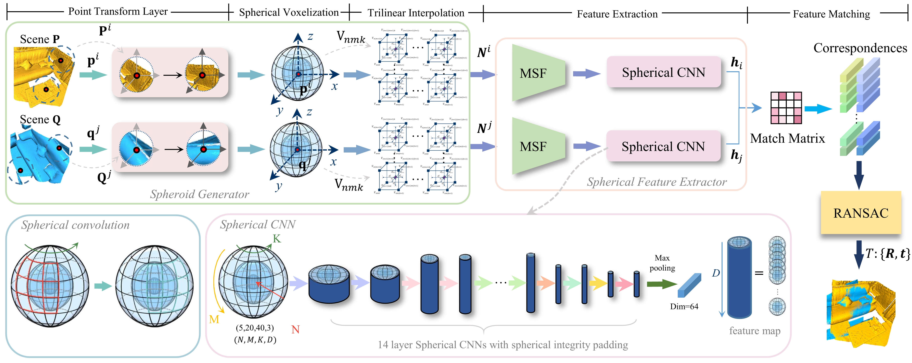
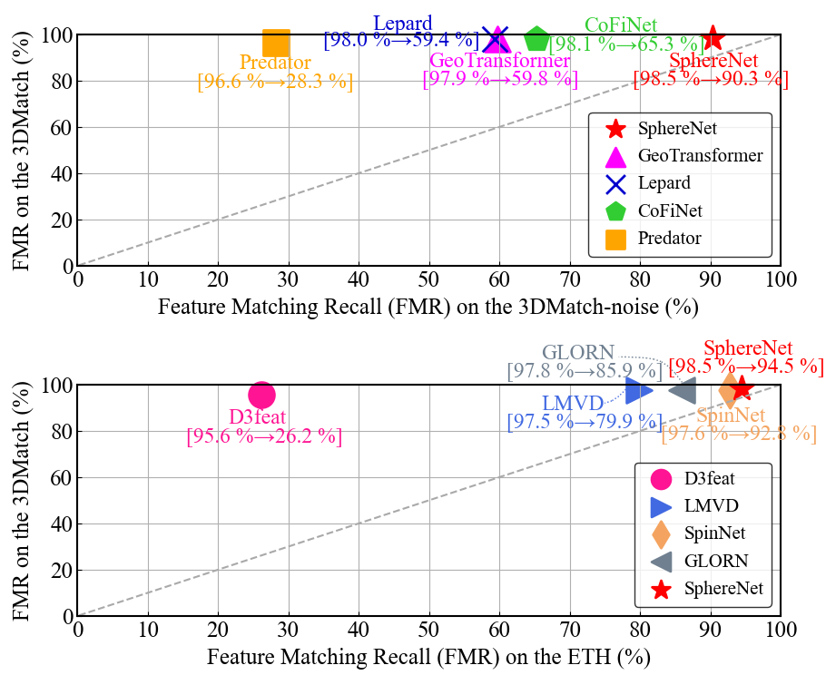

# SphereNet: Learning a Noise-Robust Descriptor for Point Cloud Registration


### (1) Overview

<p align="center">  </p>

[//]: # (<p align="center">  </p>)


### (2) Setup
This code has been tested with 
1. Python 3.9, Pytorch 1.11.0, CUDA 10.2 on Arch Linux.
2. Python 3.9, Pytorch 1.11.0, CUDA 11.1 on Ubuntu 20.04.

- Clone the repository 
```
git clone https://github.com/GuiyuZhao/SphereNet && cd SphereNet
```
- Setup conda virtual environment
```
conda create -n spherenet python=3.9
source activate spinnet
conda install pytorch==1.11.0 torchvision==0.12.0 cudatoolkit=11.3 -c pytorch
conda install -c open3d-admin open3d==0.11.1
pip install "git+git://github.com/erikwijmans/Pointnet2_PyTorch.git#egg=pointnet2_ops&subdirectory=pointnet2_ops_lib"
```
- Prepare the datasets

You can download the KITTI dataset from [Google Drive](https://drive.google.com/file/d/1fuJiQwAay23BUKtxBG3__MwStyMuvrMQ/view?usp=sharing) or [Baidu Yun](https://pan.baidu.com/s/1FB7IUbKAAlk7RVnB_AgwcQ) (Verification code:d1vn),
download the KITTI dataset from [website](https://share.phys.ethz.ch/~gsg/3DSmoothNet/data/ETH.rar),
and download processed 3DMatch dataset from [Baidu Yun](https://pan.baidu.com/s/1KltoYtAnNSEzBw3j6QOL1w?pwd=6nkf) (Verification code:6nkf).

Then the structure is as follows:
```
--data--3DMatch--fragments
              |--intermediate-files-real
              |--keypoints
              |--patches
              
--data--KITTI--dataset
            |--icp
            |--patches  
                  
--data--ETH--gazebo_summer
          |--gazebo_winter
          |--wood_autmn
          |--wood_summer
```

### (3) 3DMatch
Follow the SpinNet to download and place the 3DMatch dataset.

**Training**

Training SphereNet on the 3DMatch dataset:
```
cd ./ThreeDMatch/Train
python train.py
```

**Testing**

We provide two methods based on keypoint extraction for testing.
#### 1. SphereNet1
Evaluate the performance of the trained models on the 3DMatch dataset by random sampling.

```
cd ./ThreeDMatch/Test
python preparation.py
```
The learned descriptors for each point will be saved in `ThreeDMatch/Test/SphereNet_{timestr}/` folder and
`samplings` is the number of keypoints.
Then the `Feature Matching Recall(FMR)` and `transformation` can be calculated by running:
```
python evaluate_3DMatch.py [timestr] [samplings]
```
#### 2. SphereNet2
Evaluate the performance of the trained models on the 3DMatch dataset with keypoint extraction module of Predator.

```
cd ./ThreeDMatch/Test
python preparation_3DMatch_kp.py [samplings]
```

Then the `Feature Matching Recall(FMR)` and `transformation` can be calculated by running:
```
python evaluate_3DMatch_kp.py [timestr] [samplings]
```

### (4) 3DLoMatch
**Testing**
#### 1. SphereNet1

Evaluate the performance of the trained models on 3DLoMatch by random sampling.
```
cd ./ThreeDMatch/Test
python preparation.py
```

Then the `Feature Matching Recall(FMR)` and `transformation` can be calculated by running:
```
python evaluate_3DLoMatch.py [timestr] [samplings]
```
#### 2. SphereNet2
Evaluate the performance of the trained models on 3DLoMatch with keypoint extraction module of Predator.

```
cd ./ThreeDMatch/Test
python preparation_3DLoMatch_kp.py [samplings]
```

Then the `Feature Matching Recall(FMR)` and `transformation` can be calculated by running:
```
python evaluate_3DLoMatch_kp.py [timestr] [samplings]
```

### (5) 3DMatch-noise
#### 1. SphereNet1

Evaluate the performance of the trained models on 3DMatch-noise by random sampling.
`type` is the type of noise, `type=1` for Noise 1, `type=2` for Noise 2, and `type=3` for Noise 3.
```
cd ./ThreeDMatch/Test
python preparation.py [type]
```

Then the `Feature Matching Recall(FMR)` and `transformation` can be calculated by running:
```
python evaluate_3DMatch.py [timestr] [samplings]
```
#### 2. SphereNet2
Evaluate the performance of the trained models on 3DMatch-noise with keypoint extraction module of Predator.

```
cd ./ThreeDMatch/Test
python preparation_3DMatch_kp.py [samplings] [type]
```

Then the `Feature Matching Recall(FMR)` and `transformation` can be calculated by running:
```
python evaluate_3DMatch_kp.py [timestr] [samplings]
```


[//]: # (### &#40;4&#41; KITTI)

[//]: # (Download the processed dataset from [Google Drive]&#40;https://drive.google.com/file/d/1fuJiQwAay23BUKtxBG3__MwStyMuvrMQ/view?usp=sharing&#41;, [Baidu Yun]&#40;https://pan.baidu.com/s/1FB7IUbKAAlk7RVnB_AgwcQ&#41; &#40;Verification code:d1vn&#41;, and put the folder into `data`. )

[//]: # (Then the structure is as follows:)

[//]: # (```)

[//]: # (--data--KITTI--dataset)

[//]: # (            |--icp)

[//]: # (            |--patches)

[//]: # ()
[//]: # (```)

[//]: # ()
[//]: # (**Training**)

[//]: # ()
[//]: # (Training SpinNet on the KITTI dataset:)

[//]: # ()
[//]: # (```)

[//]: # (cd ./KITTI/Train/)

[//]: # (python train.py)

[//]: # (```)

[//]: # ()
[//]: # (**Testing**)

[//]: # ()
[//]: # (Evaluate the performance of the trained models on the KITTI dataset:)

[//]: # ()
[//]: # (```)

[//]: # (cd ./KITTI/Test/)

[//]: # (python test_kitti.py)

[//]: # (```)
[//]: # ()
[//]: # ()
[//]: # (### &#40;5&#41; ETH)

[//]: # ()
[//]: # (The test set can be downloaded from [here]&#40;https://share.phys.ethz.ch/~gsg/3DSmoothNet/data/ETH.rar&#41;, and put the folder into `data`, then the structure is as follows:)

[//]: # (```)

[//]: # (--data--ETH--gazebo_summer)

[//]: # (          |--gazebo_winter)

[//]: # (          |--wood_autmn)

[//]: # (          |--wood_summer)

[//]: # (```)

### (6) Generalization across Unseen Datasets 

**3DMatch to ETH**

The test set can be downloaded from [here](https://share.phys.ethz.ch/~gsg/3DSmoothNet/data/ETH.rar), and put the folder into `data`
Generalization from 3DMatch dataset to ETH dataset:
```
cd ./generalization/ThreeDMatch-to-ETH
python preparation.py
```

Then the `Feature Matching Recall` and `transformation` can be calculated by running
```
python evaluate.py [timestr]
```

**3DMatch to KITTI**

Generalization from 3DMatch dataset to KITTI dataset:

```
cd ./generalization/ThreeDMatch-to-KITTI
python test.py
```

### (7) Demo: use our SphereNet for your own data
If necessary, you will need to change the radius parameter to fit your data.
```
cd ./ThreeDMatch/Test
python demo.py [samplings] [source_path] [target_path]
```

## Acknowledgement

In this project, we use parts of the implementations of the following works:

* [Pointnet2_PyTorch](https://github.com/erikwijmans/Pointnet2_PyTorch)
* [PPF-FoldNet](https://github.com/XuyangBai/PPF-FoldNet)
* [D3Feat.pytorch](https://github.com/XuyangBai/D3Feat.pytorch)
* [SpinNet](https://github.com/QingyongHu/SpinNet)
* [Geotransformer](https://github.com/qinzheng93/GeoTransformer)
* [Predator](https://github.com/prs-eth/OverlapPredator)


### Updates
* 03/05/2023: The code is released!


